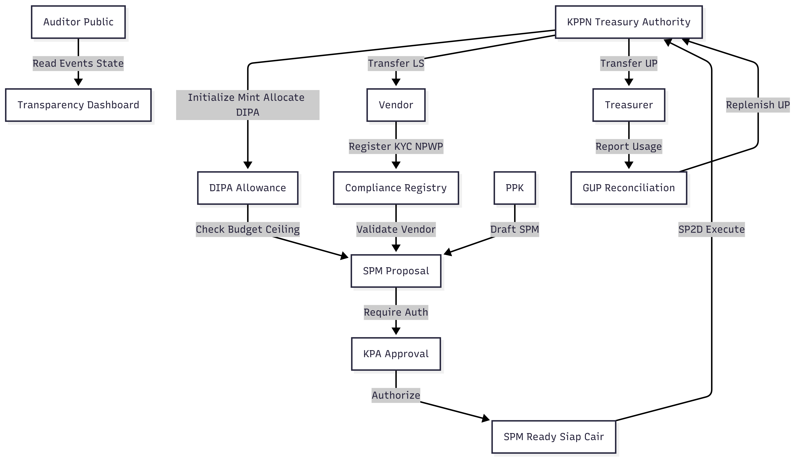

# GovChain: Government Budget Transparency via Soroban-Stellar Smart Contracts

## Overview
GovChain is a decentralized financial infrastructure designed to modernize the state budget disbursement process (APBN/APBD). By leveraging the Soroban smart contract platform on the Stellar network, this system transforms conventional bureaucratic mechanisms—such as DIPA (Budget Implementation List), SPM (Payment Order), and SP2D (Fund Disbursement Order)—into deterministic, transparent, and automated state transitions. 

## Product Requirements Document (PRD)

### Vision & Scope
* **Vision:** Democratize access to national budget data while enforcing strict expenditure control through deterministic automation.
* **Scope:** A permissioned blockchain infrastructure that acts as a single source of truth for budget allocation, vendor identity validation, multi-signature SPM approvals, and automated SP2D execution.

### User Personas & Roles

| Persona | Role in State Budget | Smart Contract Responsibilities |
| :--- | :--- | :--- |
| **KPA** (Budget User Authority) | Executive head of the Working Unit (Satker). | Sets limits for operational cash (UP), provides final cryptographic authorization (multi-sig) for massive disbursements, confirms integrity pacts. |
| **PPK** (Commitment Maker Official) | Operational official handling third-party contracts. | System initiator; drafts the SPM (`propose_spm`), attaches contract hash references, and sets payment schedules. |
| **Treasurer** (Bendahara) | Cash holder for daily operations. | Sole authorized entity to execute operational cash disbursements (SP2D-UP) and trigger replenishment reconciliation (GUP). |
| **KPPN** (Treasury Authority) | State cashier and settlement entity. | "Super Admin" in Instance Storage. Mints fiat IDR tokens and supplies initial allowance to working units based on national DIPA. |
| **Vendor** (Third Party) | Goods/services provider. | Passive destination address for SP2D-LS transfers. Must register KYC/Tax profiles in the Registry Contract. |
| **Auditor / Public** | Supreme Audit Agency (BPK) or citizens. | Read-only access to query contract status and aggregate Event Logs to monitor budget absorption rates. |

### Bureaucracy and Public Finance Terms (EN)
- **APBN / APBD:** The main state or regional "wallet" - the annual plan of revenues and spending.
- **DIPA (Budget Implementation List):** An official spending ceiling for an agency, similar to a credit limit for the year.
- **Satker (Work Unit):** A specific unit under a ministry or regional office that executes projects.
- **KPA (Budget User Authority):** The head of the Satker and the ultimate party accountable for the unit's spending.
- **PPK (Commitment Maker Official):** The official who prepares and signs contracts with vendors.
- **KPPN (Treasury Service Office):** The state's main cashier that holds the vault key and releases funds.
- **SPM (Payment Order Letter):** A payment request submitted by the Satker to the KPPN.
- **SP2D (Fund Disbursement Order):** The final approval from KPPN that triggers the transfer.
- **LS Mechanism (Direct):** State funds are paid directly to the vendor's account.
- **UP Mechanism (Operational Cash):** Petty cash entrusted to the unit treasurer for daily operations.

### Business Flow Diagram

### Core Functionality Modules
1. **Centralized Compliance Registry:** A dedicated sub-contract mapping national tax IDs (NPWP) and business registries to vendor crypto addresses. Acts as an AML/KYC gatekeeper to eliminate SP2D bounce/return incidents.
2. **Budget as Call Options:** The national treasury locks fiat in a vault. Ministries receive "Allowances" (DIPA limits) via the Stellar Asset Contract (SAC). Approved SPMs act as "exercising the option," releasing the exact equivalent to the vendor.
3. **Multisig Threshold Automation:** Digital replication of dual-approval logic. Transactions reducing budget balances require hierarchical elliptic-curve signatures (PPK and KPA) using Soroban's `require_auth` vector.
4. **Accounting Solvency:** Utilizes multi-asset U256 math to prevent overflow and phantom value creation.

### State Storage Rental Architecture
* **Temporary Storage:** Ephemeral data (e.g., failed SPM drafts). Permanently purged when TTL reaches 0.
* **Persistent Storage:** Long-term critical data (e.g., vendor registries, historical DIPA). Archived if TTL expires and restorable via `RestoreFootprintOp`.
* **Instance Storage:** Bound to the contract's lifecycle. Used for global variables like KPA admin addresses and tax rate thresholds.

### Testnet Smart Contract ID
CA5QOH5356CFJU372VJJJ3KQW2X6HZJVNDKEUGCUDVXFTTCAIJW2TC6J